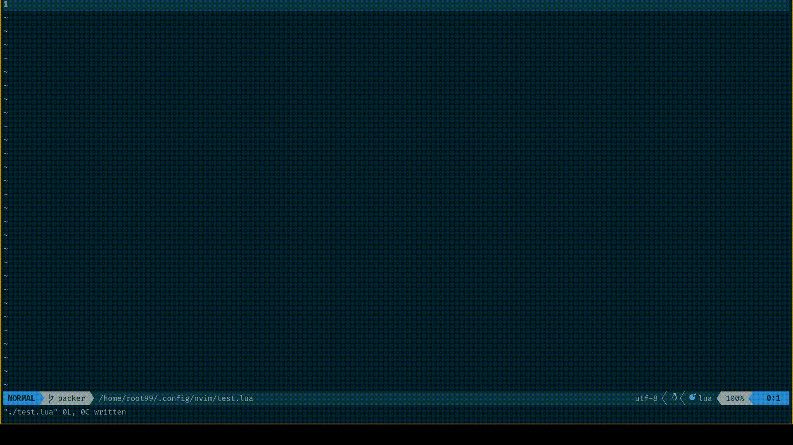
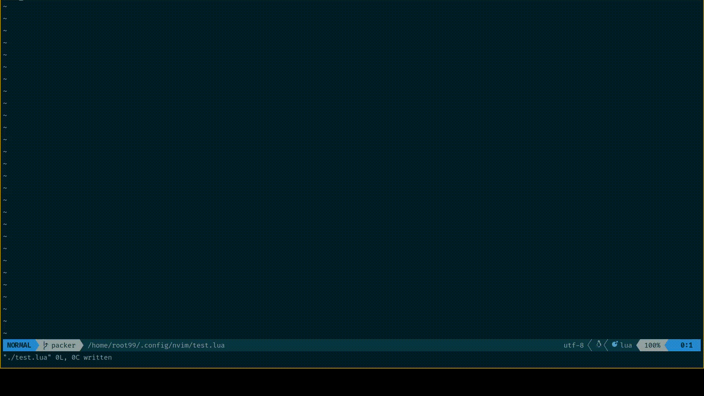
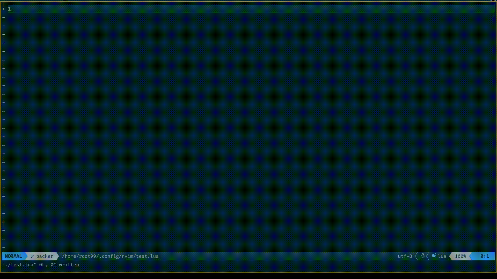
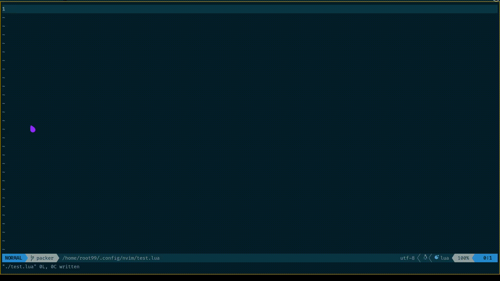
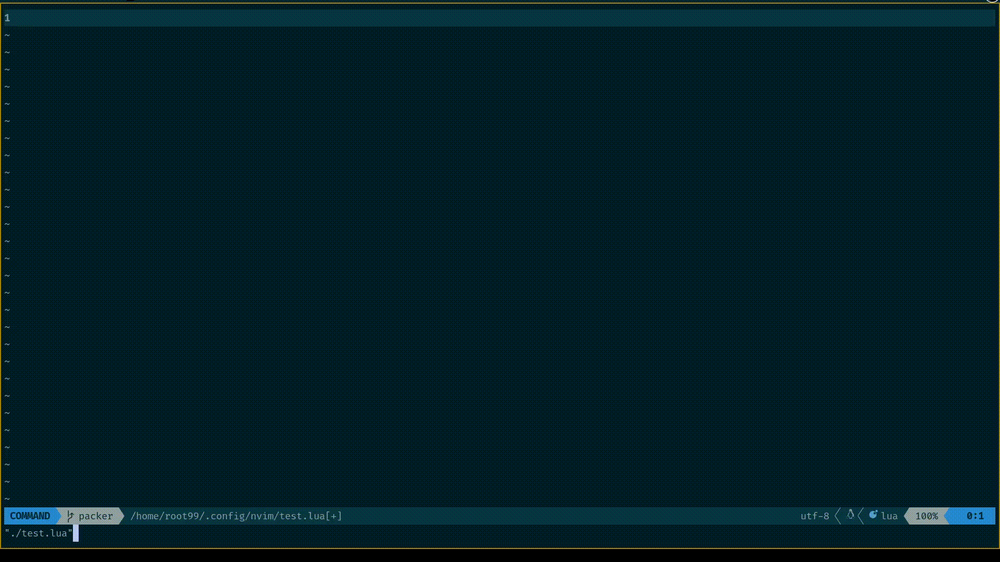
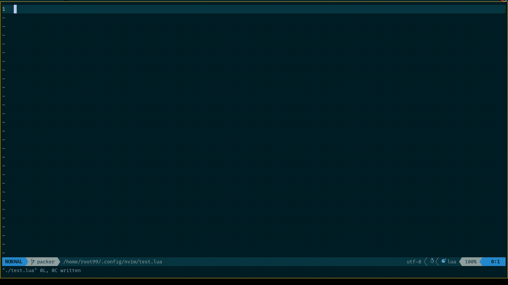

### This plugin is under development

# Figlet.nvim

## About
This plugin gives an easy wrapper around the already available command line utility **figlet**. This is useful for giving a stylish look to your config files.

Note: 🙇I am a noob in lua and plugin development, So this is just my attempt to write a plugin. Any suggestions are appreciated.

## Dependencies
- You should have command line utility called figlet
```bash
sudo pacman -S figlet
```
- Fonts for figlet in initial release I have used font called as ANSI shadow and ANSI Regular. You should have these fonts installed.
PS : fallback to default will be implemented in future
```bash
git clone https://github.com/xero/figlet-fonts.git
cp  figlet-fonts/* /usr/share/figlet/fonts/
```

- Comment Support using comment.nvim
Please Install comment.nvim if you want comment support
```lua
use("numToStr/Comment.nvim")
```

## Installation

You can use any plugin Manager you use
- Packer.nvim
```lua
	use({
		"pavanbhat1999/figlet.nvim",
		requires = "numToStr/Comment.nvim",
	})
```

## Config

```lua
require("figlet").Config({font="3d"})
```
## Commands

```vim
 :FigComment <pattern>
 :Fig <pattern>
 :FigCommentHighlight <pattern>
 :FigList
 :FigSelect
 :FigSelectComment
```

## Usage
Syntax  `:FigComment <pattern_string>`

Example `:FigComment NeoVim`



Syntax  `:Fig <pattern_string>`

Example  `:Fig neovim`



Syntax  `:FigCommentHighlight <pattern_string>`

Example  `:FigCommentHighlight neovim`



## Convert normal text to ASCII arts

Syntax `:FigSelect`

Example `:FigSelect`



Syntax `:FigSelectComment`

Example `:FigSelectComment`



Syntax `:FigList`

Example `:FigList`



# TODO

1. Add Telescope List to show fonts
2. Visual Select -> Figlet
3. Follow Best practice

